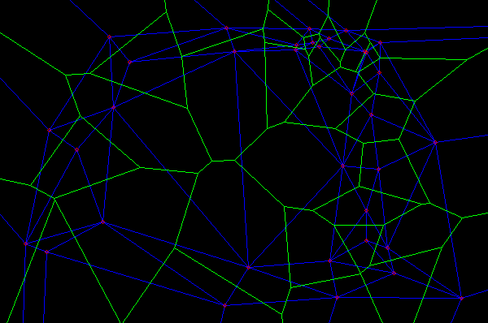

# voronoi
This repository implement basic algorithms for voronoi diagram and visualize them.

## Bowyer Watson Method

source: *bowyer_watson.h, bowyer_watson.cpp, bowyer_watson_test.cpp*

For finding bad triangulation, we can use some data structure to speed. (If you have considerable fine meshes)

## Directly compute for every pixel

source: *direct.h, direct.cpp, direct_test.cpp*

We compute distance map preliminary to speed up.

The for loop for scanning all pixels can be parallelized. (If you have a lot of pixels)

Euclidean distance

Manhattan distance

Cubic distance

## OpenCV Subdiv2D class (Bowyer Watson Method)

source; *cv_example.cpp*

## Others...

## Contact

ccwang.jack@gmail.com
